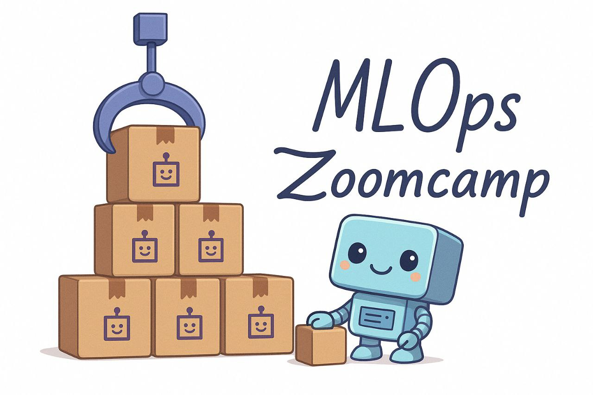

  

<h1 align="center">
    <strong>MLOps Zoomcamp: A Free 9-Week Course on Productionizing ML Services</strong>
</h1>

MLOps (machine learning operations) is a must-know skill for many data professionals. Master the fundamentals of MLOps, from training and experimentation to deployment and monitoring. 

This repository contains <strong>my personal implementation</strong> of the MLOps Zoomcamp course by DataTalks.Club. All code, solutions, and notes are my own work, based on the official course materials.

## How to Take MLOps Zoomcamp

### 2025 Cohort
- **Start Date**: May 5, 2025

### Self-Paced Learning
All course materials are freely available for independent study. Follow these steps:
1. Watch the course videos.
2. [Slack community](https://datatalks.club/slack.html).
3. [FAQ document](https://docs.google.com/document/d/12TlBfhIiKtyBv8RnsoJR6F72bkPDGEvPOItJIxaEzE0/edit) for guidance.

## Syllabus
The course consists of structured modules, hands-on workshops, and a final project to reinforce your learning. Each module introduces core MLOps concepts and tools.

### Prerequisites
To get the most out of this course, you should have prior experience with:
- Python
- Docker
- Command line basics
- Machine learning (e.g., through [ML Zoomcamp](https://github.com/alexeygrigorev/mlbookcamp-code/tree/master/course-zoomcamp))
- 1+ year of programming experience

## Modules

### [Module 1: Introduction](01-intro)
- What is MLOps?
- MLOps maturity model
- NY Taxi dataset (our running example)
- Why MLOps is essential
- Course structure & environment setup
- Homework

### [Module 2: Experiment Tracking & Model Management](02-experiment-tracking)
- Introduction to experiment tracking
- MLflow basics
- Model saving and loading
- Model registry
- Hands-on MLflow exercises
- Homework

### [Module 3: Orchestration & ML Pipelines](03-orchestration)
- Workflow orchestration
- Airflow
- Homework

### [Module 4: Model Deployment](04-deployment)
- Deployment strategies: online (web, streaming) vs. offline (batch)
- Deploying with FastAPI (web service) with MLFlow
- Batch scoring for offline processing with S3, MLFlow and Airflow
- Streaming deployment with AWS Kinesis & Lambda [not implemented]
- Homework

### [Module 5: Model Monitoring](05-monitoring)
- Monitoring ML-based services
- Web service monitoring with Prometheus, Evidently, and Grafana
- Batch job monitoring with Prefect, MongoDB, and Evidently
- Homework

### [Module 6: Best Practices](06-best-practices)
- Unit and integration testing
- Linting, formatting, and pre-commit hooks
- CI/CD with GitHub Actions
- Infrastructure as Code (Terraform)
- Homework

### [Final Project](07-project/)
- End-to-end project integrating all course concepts

## Community & Support

### Getting Help on Slack

Join the [`#course-mlops-zoomcamp`](https://app.slack.com/client/T01ATQK62F8/C02R98X7DS9) channel on [DataTalks.Club Slack](https://datatalks.club/slack.html) for discussions, troubleshooting, and networking.

To keep discussions organized:
- Follow [our guidelines](asking-questions.md) when posting questions.
- Review the [community guidelines](https://datatalks.club/slack/guidelines.html).